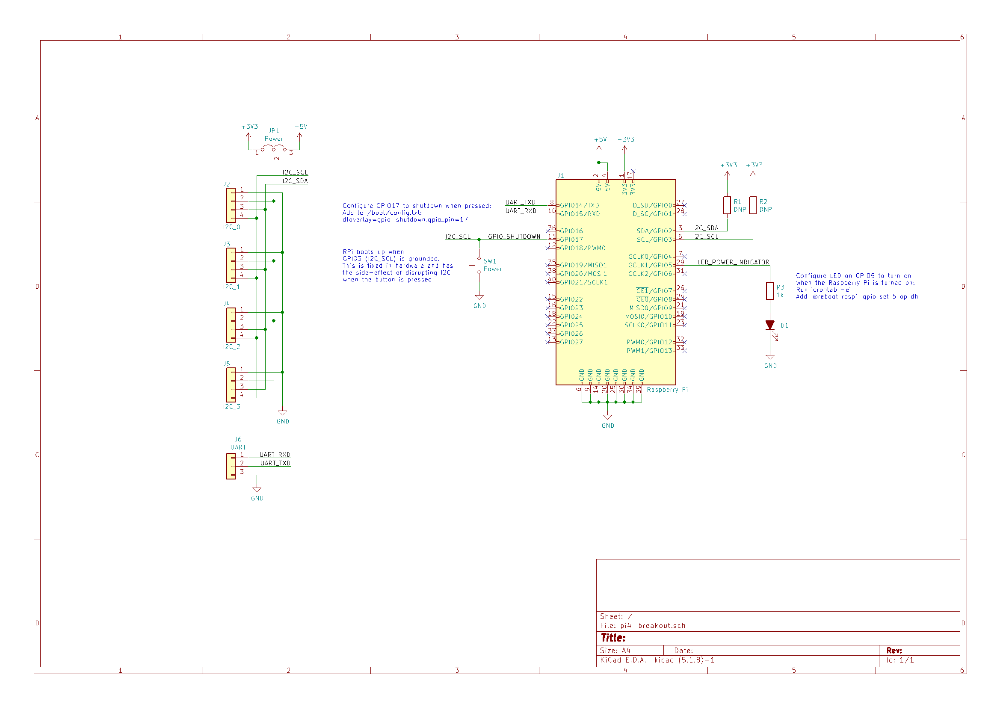
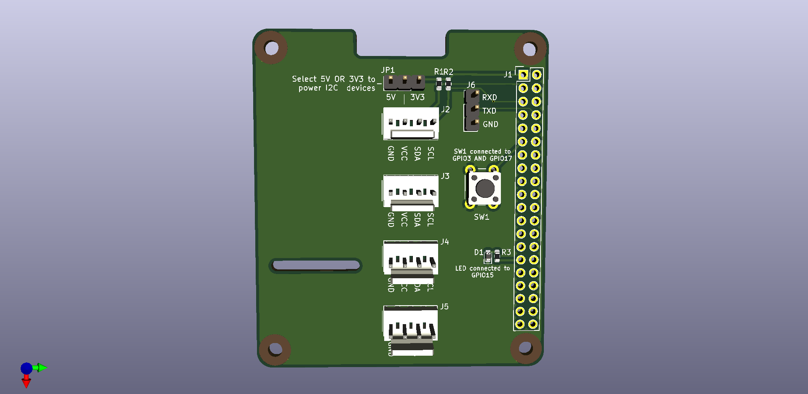

Hat template from [xesscorp/RPi_Hat_Template](https://github.com/xesscorp/RPi_Hat_Template).

- 4x connectors for I2C, silkscreen is for KF2510 (or KK 254)
- `GPIO3` (`I2C_SCL`) is connected to a button because grounding it will boot up the Pi after a shutdown (see [`WAKE_ON_GPIO`](https://www.raspberrypi.org/documentation/hardware/raspberrypi/bcm2711_bootloader_config.md))
- `GPIO17` is another arbitrary pin configured to shutdown the Pi when grounded (`dtoverlay=gpio-shutdown,gpio_pin=17` in `/boot/config.txt`)
- Surprisingly, connecting these two pins together and grounding them will startutp/shutdown the Pi, even though `SCL` is pulled low as part of I2C operation. There has been some anecdotal evidence [here](https://www.raspberrypi.org/forums/viewtopic.php?p=1565264#p1565264). Perhaps the deboucing on the shutdown overlay prevents it from triggering?
- `GPIO5` has an LED connected to it - configuring cron to set this pin `HIGH` on boot essentially makes this an indicator for whether the Pi is powered on (note that this pin turns off before the Pi is fully off - a Raspberry Pi 4B has been observed to still be blinking its `ACT` LED when `GPIO5` turns off). Probably a good idea to wait for the `ACT` LED to stop blinking before cutting power.
